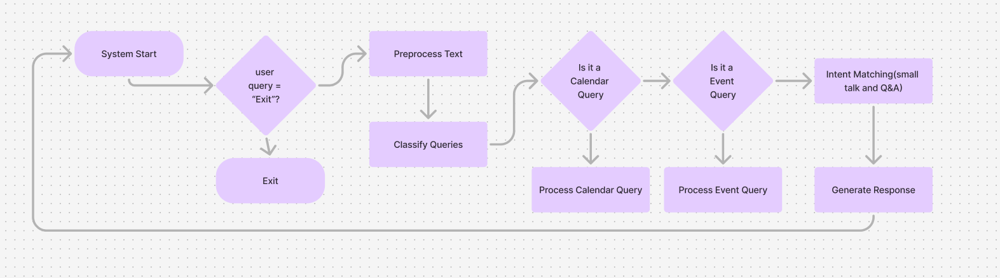

# NLP Chatbot

An AI chatbot that manages calendar events, answers questions, tells jokes, and engages in natural conversation using core NLP techniques.

---

## Overview

This chatbot was developed using traditional NLP techniques including tokenisation, stemming, TF-IDF vectorisation, and logistic regression. It can classify user intents, personalise responses, and interface with calendar data for practical scheduling support.

---

## Introduction

The chatbot focuses on:

- Handling university calendar-related queries
- Answering general Q&A
- Maintaining basic conversational flow
- Tracking context and user identity

---

## Architecture

> **Diagram**: Shows NLP pipeline → intent matcher → calendar parser → context manager → response generator

**Core Components:**

- **Preprocessing:** Tokenisation, stemming, stop word removal, and lowercasing
- **Intent Matching:** TF-IDF vectorisation (unigrams/bigrams, top 5000 features) and cosine similarity
- **Calendar Access:** Parses iCal files, extracts events by type and date
- **Context Tracking:** Maintains conversational thread for follow-up questions
- **Identity Management:** Stores user names to personalise dialogue

---

## Conversational Design

- **Prompt Design:** Friendly and helpful system prompts
- **Discoverability:** Explains capabilities on request
- **Error Handling:** Graceful fallback messages
- **Personalisation:** Remembers and uses user names
- **Context Awareness:** Handles multi-turn dialogue about calendar events

---

## Evaluation

- **Early-stage Testing:** Wizard-of-Oz study to collect natural user input and refine intents
- **Pilot Testing:** Dialogue simulations with expected and edge-case user flows

---

## Example Conversation
<pre>
AI: Welcome back, Jon. How can I help?

You: my name is jonny
AI: Nice to meet you, Jonny!

You: how are you
AI: I'm just a chatbot but thank you for asking Jonny!

You: what can you do
AI: I can assist you with a variety of different tasks!
    - Telling jokes
    - Answering questions
    - Letting you know when your next lecture is
    - Giving information about a module
    - Type 'exit' to finish our conversation

You: tell me a joke
AI: Why did the chicken cross the road - to get to the other side

You: how many r's in strawberry
AI: There are 3 R's in strawberry!

You: what lecture do I have today
AI: You have one lecture today:
    Human-AI Interaction from Monday, 14 October 2024, 01:00 PM to 02:00 PM.

You: what lecture do I have tomorrow
AI: You have one lecture tomorrow:
    Human-AI Interaction from Tuesday, 15 October 2024, 04:00 PM to 05:00 PM.

You: what workshops do I have this week
AI: You have 2 events this week:
    1. Professional Ethics in Computing (Workshop)
       📍 Thursday, 17 October 2024, 11:00 AM – 01:00 PM
    2. Music and Mixed Reality (Workshop)
       📍 Thursday, 17 October 2024, 03:00 PM – 06:00 PM

You: who teaches this module
AI: The lecturer for 'Professional Ethics in Computing' is Prof B. Stahl.

You: where is it located
AI: The event will take place at Jubilee Campus, Exchange, Room C03.
AI: Lecturers for 'Human-AI Interaction' are Dr O. Eke, Prof J. Fischer and Dr J. Clark.
</pre>

